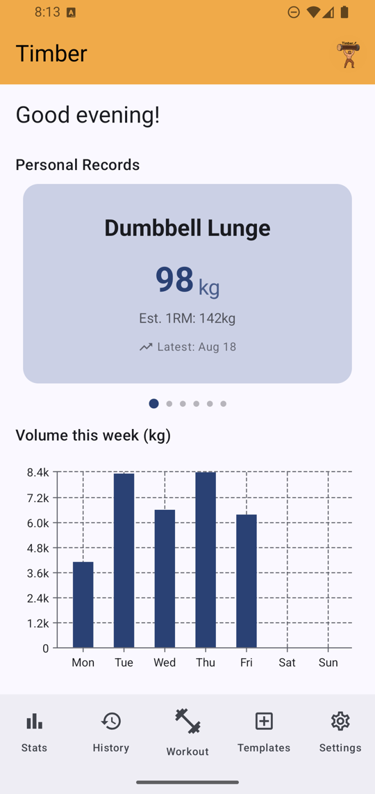
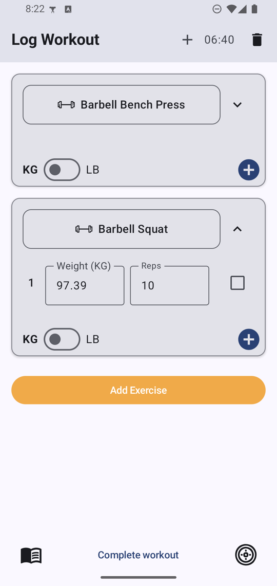
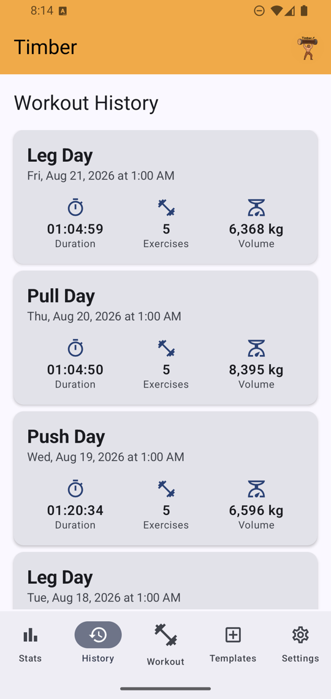
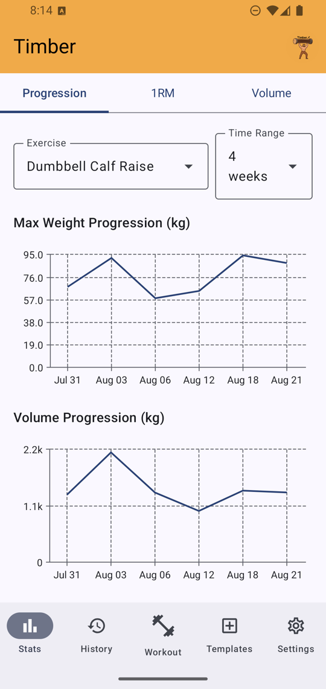
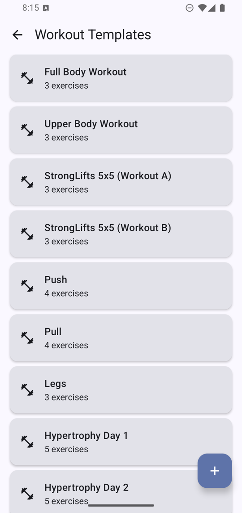
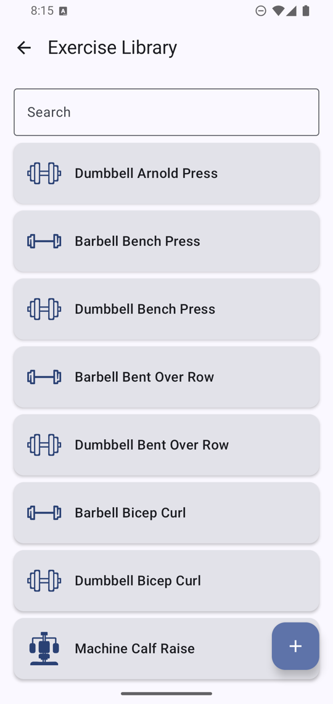
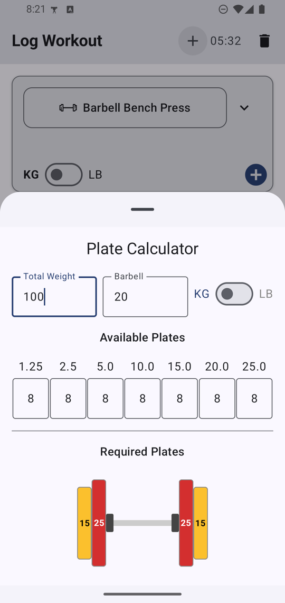
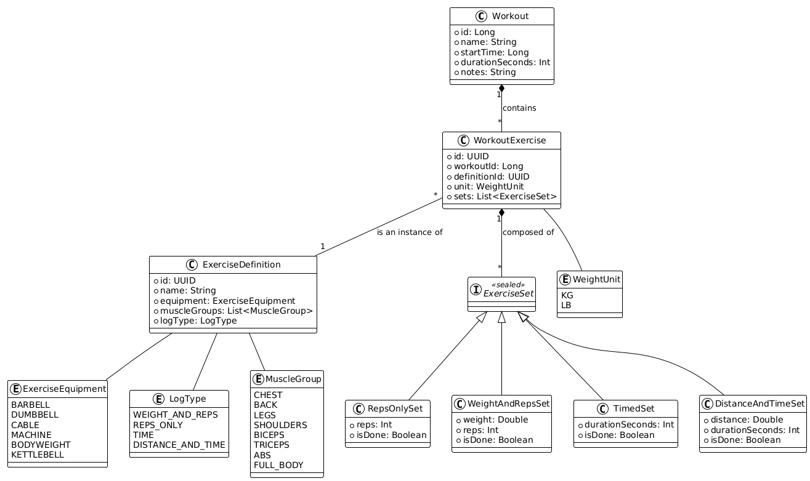

# Timber: Workout Logs
<div align="center">
  
</div>

Timber is a modern, offline-first workout logging application for Android, built with 100% Kotlin
and Jetpack Compose. It's designed for fitness enthusiasts who want a simple, clean, and efficient
way to track their strength training progress, without the 'connected' nature imposed by many similar applications on the market.

## Features

- **Intuitive Logging:** Easily log your workouts, including exercises, sets, reps, and weight.
- **Exercise Library:** A pre-loaded, customizable library of common strength training exercises.
- **Workout Templates:** Create and save your own workout routines to start logging faster.
- **Pre-built Programs:** Comes with popular, proven workout templates like StrongLifts 5x5 and
  Push/Pull/Legs (PPL) to get you started.
- **History & Progress:** Visualise your progress over time with volume charts, per-exercise
  progression and estimated one-rep-max trends.
- **Offline First:** Designed to work completely offline. Your data is stored locally and is always
  available.
- **Material Design 3:** A clean, modern, and dynamic user interface built with the latest Material
  Design components.

## Screenshots

|                    Home                    |                  Log Workout                  |               Workout History               |
|:------------------------------------------:|:---------------------------------------------:|:-------------------------------------------:|
|   |   |  |
|                 **Stats**                  |                 **Templates**                 |            **Exercise Library**             |
|        |   |  |

The plate calculator, available from the bottom bar while logging, works out which plates to load
for a given total:



> The figures shown are generated demo data, not real training logs. A fresh install starts with an
> empty history; debug builds can generate a sample one from Settings → Developer.

## Tech Stack & Architecture

Timber is built using modern Android development practices and libraries.

- **UI:** 100% [Jetpack Compose](https://developer.android.com/jetpack/compose) using the Material 3
  design system.
- **Architecture:** Follows a standard MVVM (Model-View-ViewModel) pattern with a Repository layer
  to abstract data sources.
- **Database:** [Room](https://developer.android.com/training/data-storage/room) for local,
  persistent storage in a SQLite database.
- **Asynchronous Programming:**
  [Kotlin Coroutines](https://kotlinlang.org/docs/coroutines-overview.html)
  and [Flow](https://kotlinlang.org/docs/flow.html) for managing background threads and handling
  streams of data.
- **Dependency Injection:** [Hilt](https://dagger.dev/hilt/) for managing dependencies and
  decoupling components.
- **Navigation:** [Compose Navigation](https://developer.android.com/jetpack/compose/navigation) for
  handling screen transitions within the app.

### Data model

The core entities and how they relate are documented as a class diagram:

[](docs/uml/timber_classes.png)

A `Workout` owns its `WorkoutExercise` rows, each of which points at a reusable
`ExerciseDefinition` and holds a list of `ExerciseSet`. `ExerciseSet` is a sealed type
(`WeightAndRepsSet`, `RepsOnlySet`, `TimedSet`, `DistanceAndTimeSet`) so that a barbell lift, a
set of pull-ups, a plank and a row on the erg can all be logged through the same model. The diagram
is generated from [`docs/uml/timber_classes.uml`](docs/uml/timber_classes.uml)
([PlantUML](https://plantuml.com/)) - edit that file and re-render if you change the schema.

## Getting Started

To get the project up and running on your local machine, follow these steps:

1. **Prerequisites:** Make sure you have the latest stable version
   of [Android Studio](https://developer.android.com/studio) installed.
2. **Clone the repository:**
   ```bash
   git clone https://github.com/BoydyP/Timber.git
   ```
3. **Open in Android Studio:** Open the cloned project in Android Studio.
4. **Build and Run:** Build and run the `app` module on an emulator or physical device.

No database setup is needed. The reference catalog — the 55 default exercises and the ten default
templates — is seeded on first launch by `DatabaseInitializer.ensureCatalogSeeded()`. Your workout
history starts empty.

If you want populated charts to work on the stats or history screens, debug builds expose a
**Developer** section at the bottom of Settings that can generate 60 days of demo history (and clear
it again). It is compiled out of release builds. See [CONTRIBUTING.md](CONTRIBUTING.md) for the
build and test commands in full.

## Contributing

Contributions are welcome! If you have a suggestion or find a bug, please open an issue - there are
templates for [bug reports](.github/ISSUE_TEMPLATE/bug_report.yml) and
[feature requests](.github/ISSUE_TEMPLATE/feature_request.yml).

Found a security issue? Please don't open a public issue — see [SECURITY.md](SECURITY.md) for how to
report it privately.

Before opening a pull request, please read [CONTRIBUTING.md](CONTRIBUTING.md). It covers the toolchain
(including why the Gradle wrapper is pinned), the build and test commands, the conventions this
codebase follows, and the things that are easy to get wrong - Room migrations, weight-unit
conversion, and writing instrumentation tests against the seeded data.

## License

This project is licensed under the MIT License - see the [LICENSE.md](LICENSE.md) file for details.
